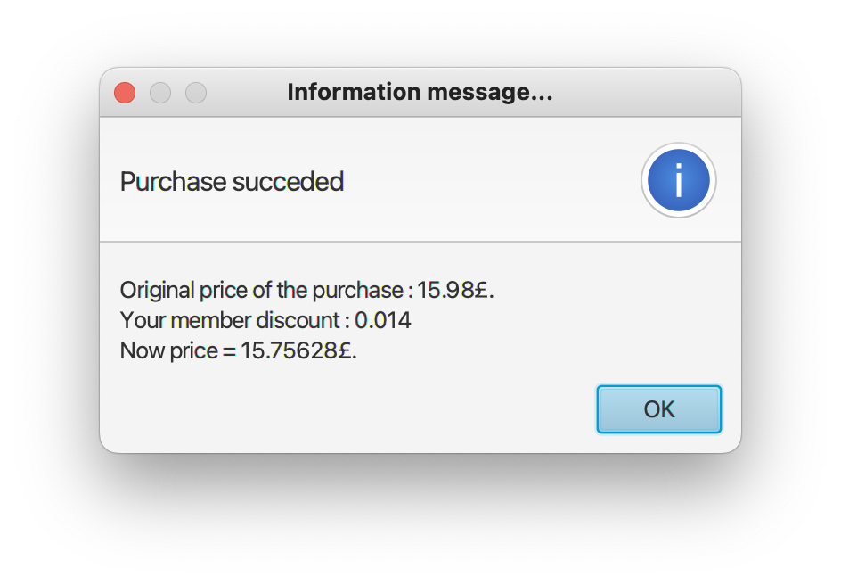

# Cinema Ticketing System

## Detailed README

**Date**: 27/06/2022

### Project Overview

The Cinema Ticketing System is a Java-based application developed as part of my academic exchange program in London. The application serves as a complete management system for a cinema, offering functionalities for both customers and administrators. This includes ticket purchasing, user account management, employee management, and statistics analysis. The system is built using the Model-View-Controller (MVC) design pattern to provide a modular and scalable solution. It features a Java Swing-based graphical user interface (GUI) and integrates with a SQL database for dynamic data storage and management.

### Key Features

1. **User Account Management**: Customers can create an account, log in, view and update personal information, and purchase tickets. Administrators have additional privileges to manage employee accounts, including adding, updating, and removing employee records.

2. **Ticket Purchase System**: Customers can browse available movies, view showtimes, and purchase tickets. The system supports different ticket categories, such as child, adult, and senior, each with distinct pricing options.

3. **Employee Management**: Administrators can manage employee records, including registering new employees, updating their information, or removing them from the system.

4. **Statistics and Reporting**: The system provides administrators with access to ticket sales statistics by movie type and ticket category. This data is useful for understanding customer preferences and optimizing movie offerings.

5. **Graphical User Interface (GUI)**: A Java Swing-based GUI is provided for easy navigation. The interface includes separate views for customers and administrators, making the system accessible and efficient to use.

6. **Database Integration**: The project utilizes an SQL database to store customer, employee, movie, and ticket information. Data is managed using the Data Access Object (DAO) pattern, ensuring a clean separation between the database operations and the business logic.

### Technical Details

- **Programming Language**: Java
- **IDE**: NetBeans
- **Architecture**: Model-View-Controller (MVC)
- **Database**: SQL ([Cinema.sql](Cinema.sql)) using MAMP
- **Data Management**: Data Access Object (DAO) pattern
- **GUI Framework**: Java Swing

### Project Structure

The project is organized into several packages that adhere to the MVC architecture:

- **Model**: Contains data entities and DAO implementations for database operations. Classes include:
  - [Customer.java](Cinema_project/src/Model/Customer.java): Represents customer details.
  - [Employee.java](Cinema_project/src/Model/Employee.java), [EmployeeDao.java](Cinema_project/src/Model/EmployeeDao.java), [EmployeeDaoImpl.java](Cinema_project/src/Model/EmployeeDaoImpl.java): Represents employee details and their management.
  - [Movie.java](Cinema_project/src/Model/Movie.java), [MovieDao.java](Cinema_project/src/Model/MovieDao.java), [MovieDaoImpl.java](Cinema_project/src/Model/MovieDaoImpl.java): Represents movie information and its data management.
  - [Ticket.java](Cinema_project/src/Model/Ticket.java), [TicketDao.java](Cinema_project/src/Model/TicketDao.java), [TicketDaoImpl.java](Cinema_project/src/Model/Cinema_project.java): Represents ticket details and the management of ticket purchases.
  - [DataSource.java](Cinema_project/src/Model/DataSource.java): Manages the database connection.

- **View**: Contains classes related to the user interface, such as:
  - [MemberRegister.java](Cinema_project/src/View/MemberRegister.java), [MemberLogin.java](Cinema_project/src/View/MemberLogin.java), [EmployeeLogin.java](Cinema_project/src/View/EmployeeLogin.java): Handles the registration and login forms for members and employees.
  - [MovieSearch.java](Cinema_project/src/View/MovieSearch.java), [MovieInfos.java](Cinema_project/src/View/MovieInfos.java): Allows users to search for movies and view detailed information.
  - [PaymentView.java](Cinema_project/src/View/EmployeeManagment.java), [TicketRegister.java]: Handles payment processes and ticket registrations.
  - [EmployeeManagment.java](Cinema_project/src/View/EmployeeManagment.java), [EmployeeUpdateInfos.java](Cinema_project/src/View/EmployeeUpdateInfos.java): Provides interfaces for managing employee information.

- **Controller**: Contains logic that handles interactions between the model and view components:
  - [CineProjectDemo.java](Cinema_project/src/controller/CineProjectDemo.java): Coordinates the workflow between the different components, processing user inputs, and managing application flow.

### How to Set Up and Run

1. **Database Setup**:
   - Import the [Cinema.sql](Cinema.sql) script to your SQL database management system using MAMP to create the required tables and insert initial data.
   - Ensure the database server is running and that the connection details (username, password, URL) match the configuration in [DataSource.java](Cinema_project/src/Model/DataSource.java).

2. **Compile the Project**:
   - Navigate to the source directory ([src/](Cinema_project/src/)) and compile the Java files using NetBeans or directly from the command line with [javac[.

3. **Run the Application**:
   - Execute the main controller class ([CineProjectDemo.java](Cinema_project/src/controller/CineProjectDemo.java)) to launch the GUI.
   - Use the customer or administrator credentials to navigate through the application features.

### How to Use

- **Customer View**:
  - Register for a new account or log in as an existing user.
  - Browse available movies, view showtimes, and proceed to ticket purchases.
  - Manage personal information and view purchase history.

- **Administrator View**:
  - Log in using administrative credentials.
  - Manage movie information, including adding new movies, updating, or removing them.
  - View sales statistics and manage employee records.

### Screenshots

To provide a visual understanding of the application, below are screenshots of key interfaces:

1. **Home Screen**:
    

2. **Employee Login Screen**  
   

3. **New Employee Registration**  
   

4. **Delete Employee Screen**  
   

5. **Employee View 1**  
   

6. **Employee View 2**  
   

7. **Employee View 3**  
   

8. **Employee Home After Deleting All Purchases**  
   

9. **Employee Home**  
   

10. **Purchase History**  
    

11. **Purchase Succeeded**  
    

12. **Payment Failed**  
    

13. **View Basket**  
    

14. **Book a Ticket**  
    

15. **Search Movie**  
    

16. **Member Information**  
    

### Contact

If you have any questions or suggestions, please feel free to reach out to me on [LinkedIn](https://www.linkedin.com/in/sandric-b-763a65197/).
